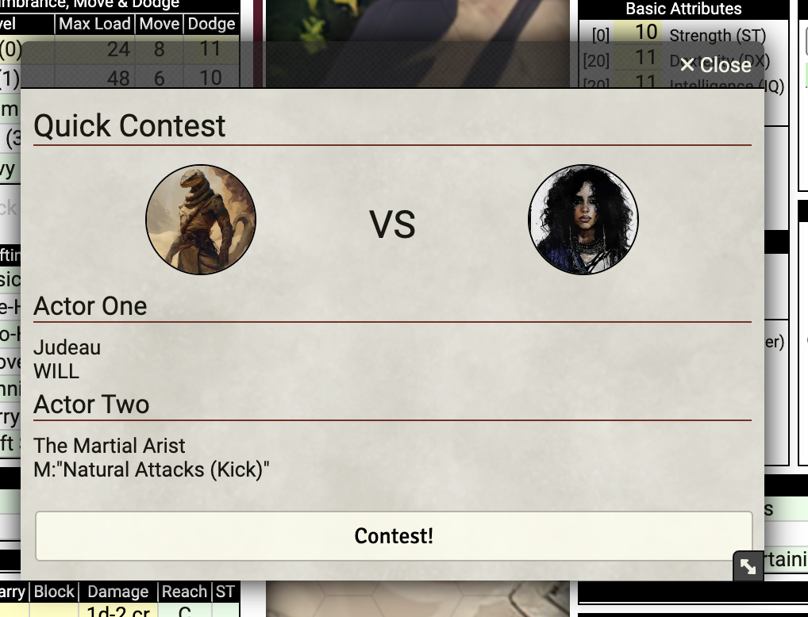
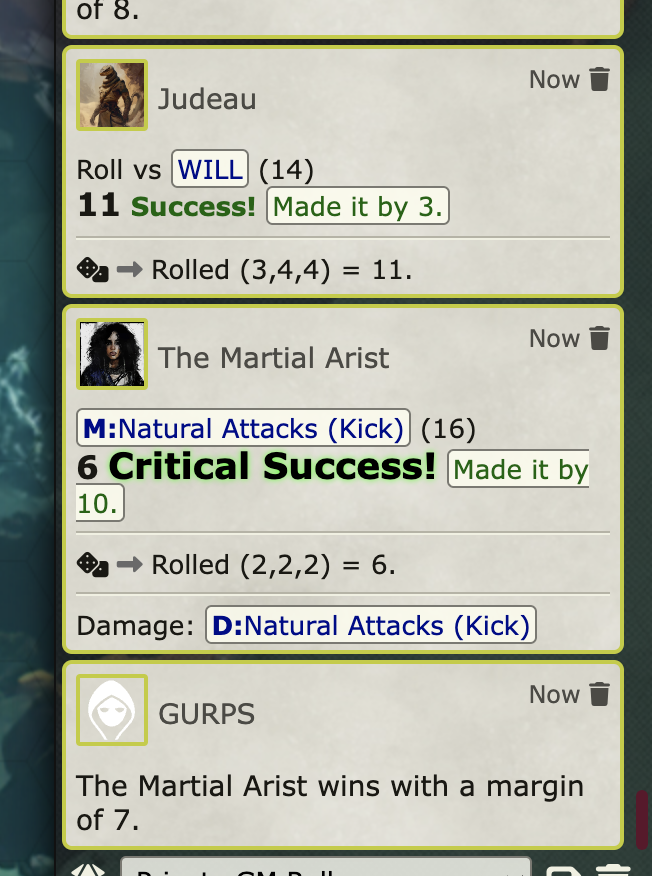

## TODO
Modifiers dont work
HOW TO SHOW CURRENT VALUE OF THE SELECTED ROLLABLE?
Remove setTimeout

## HOW TO USE

Inside Foundry VTT

- Add-on Modules
- Install Module
. In the search bar on the bottom paste this
XXXXXXX

- Activate the module inside your world

- Bottom Left: Click the QC button to open the Quick Contest window

- Now you can drag and drop rollable attributes from Actor Sheets (in this example Stealth vs Vision)

- Then click Contest!

You will see in the chat window

