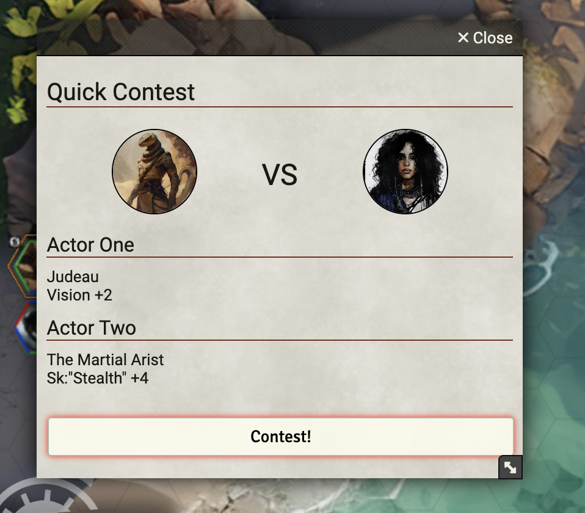

## DEV

Run webpack in watch mode
npx webpack --config webpack.config.js --watch

Use symbolic link to local development

## TODO

Modifiers dont work

How to show current value of the selected rollable (ie otf)?

Remove setTimeout

## HOW TO USE

Inside Foundry VTT

- Add-on Modules
- Install Module
. In the search bar on the bottom paste this
https://github.com/giggioz/gurps-quick-contest/releases/download/LAST_TAG/module.json
 (LAST_TAG is the last tagged version, for example v1.0.7)
https://github.com/giggioz/gurps-quick-contest/releases/download/v1.0.7/module.json

- Activate the module inside your world

- Bottom Left: Click the QC button to open the Quick Contest window =>

- Now you can drag and drop rollable attributes from Actor Sheets (in this example Will vs Kick)

- You can also drag and drop a modifier (only one!) from the modifier bucket

- Then click Contest!

You will see in the chat window

